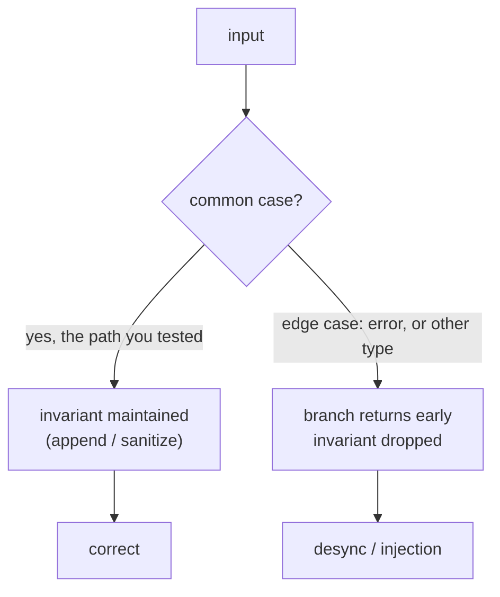

# The bug class

wp2shell is two unrelated-looking bugs, a REST batch desync and a SQL injection, found by different people in different files. They are worth reading together because they are the **same shape**: a safety guarantee that the code maintains faithfully on the common path, and silently drops on an edge path. Neither is an exotic memory-corruption trick. Both are an invariant that was only ever half-enforced.

## The shared shape: safe on the happy path only

Look at the two defects side by side.

| | Batch desync (63030) | author__not_in SQLi (60137) |
|---|---|---|
| The invariant | `$matches` stays index-aligned with `$requests` | `author__not_in` is always integers before it reaches SQL |
| Held on | every valid sub-request | array-typed input |
| Dropped on | the error sub-request (skipped the append) | string-typed input (skipped `absint`) |
| Result | wrong handler dispatched | raw string concatenated into SQL |

In both cases the developer wrote the safe path first and correctly, then added a branch for the uncommon case, an error, a different type, and forgot to carry the invariant through it. The happy path is fully guarded. The edge path quietly is not.

This is why both bugs survived review and shipped: the code looks right, and it *is* right for the inputs a developer naturally tries. You only see the defect if you send the input the branch was written to handle but not to protect.

## Why multiplexing endpoints breed the array variant

The batch desync is a specific, recurring flavor: **parallel arrays that must stay index-aligned, maintained in separate loops.** WordPress kept `$requests`, `$matches`, and `$validation` as three lists and indexed across them by position. The moment one loop appends to two of them and `continue`s past the third, the position-to-item mapping is broken for everything after it.

Request-multiplexing endpoints are unusually prone to this because bundling N operations into one call almost invites "a list of inputs, a list of matches, a list of results, zip them at the end":

- **REST/JSON batch endpoints** (this bug) collect sub-requests and their per-item outcomes in parallel.
- **GraphQL query batching** and aliased fields resolve many operations in one request and reassemble responses by position or key.
- **JSON-RPC 2.0 batch** requests are an array in, an array out, correlated by `id`.
- **Protocol multiplexing** (HTTP/2 streams, connection pools) tracks per-stream state in parallel structures keyed by an id that must never drift.

Every one of these has the same failure mode available: an error or skip in one item that updates some of the parallel state but not all of it, and a later stage that trusts position or index to still line up.

## The defensive lessons

**Keep per-item state in one structure, not parallel arrays.** If each sub-request had carried its own match and validation result as fields of a single object, there would have been no separate `$matches` array to fall out of step. Desync-by-omission is impossible when there is only one list to append to. This is the single highest-leverage fix for the whole class.

**Normalize at the boundary, unconditionally.** The SQLi existed because sanitization was conditional on type. Coercing `author__not_in` to an integer list the instant it arrives, regardless of whether it came as a string or an array, removes every downstream branch's ability to forget. Its own sibling `author__in` did exactly this and was safe. Sanitize once, at the edge, for all shapes of input.

**Fail closed on the path you did not plan for.** Both bugs fail *open*: the error branch still dispatches, the unexpected type still reaches SQL. An edge path that cannot maintain the invariant should refuse the operation, not continue without it.

**Test the error and edge paths, not just the happy path.** The exploit input is, by construction, the one a developer is least likely to try: a deliberately malformed sub-request, a parameter passed as the "wrong" type. A test that sends a batch containing a bad element, or a query var as a string instead of an array, would have caught both. The uncommon branch is exactly where the bug lives, so it is exactly where the test coverage needs to be.

## The takeaway

You do not need a novel vulnerability class to take over 500 million sites. You need one invariant that everyone assumed held everywhere, and one branch where it quietly did not. Hunt for the places your codebase keeps two things in sync by convention, or applies a safety step inside an `if`, and check what happens on the path you did not write a test for.

Back to [the batch mechanism](./mechanism.html), [the SQL injection half](./sqli-chain.html), or [detection](./detection.html).
