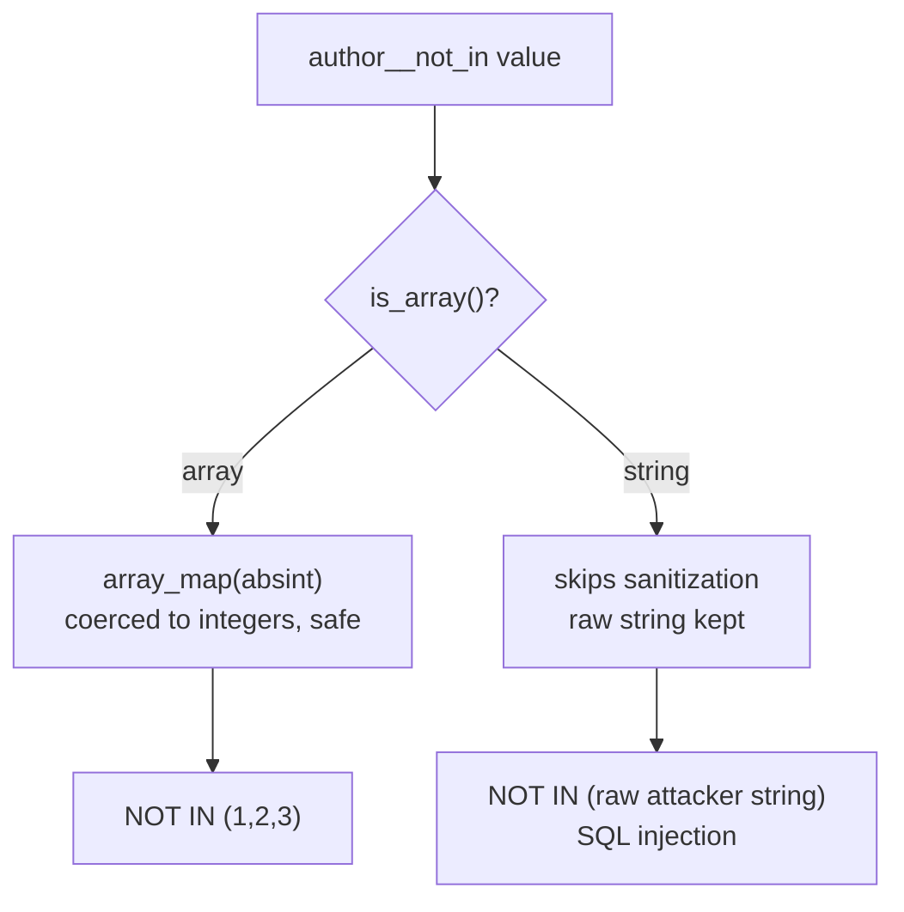

# The SQL injection half

The [batch desync](./mechanism.html) is only half of wp2shell. On its own it lets an anonymous request run under the wrong permission check, a serious logic bug, but not yet code execution. The other half is CVE-2026-60137, a SQL injection in WordPress core's `WP_Query`. This piece covers that bug at a mechanism level and shows why the two only reach their full, unauthenticated impact together.

*Grounded in the real WordPress 7.0.1-to-7.0.2 source diff. No working SQL-injection or RCE payload is published; the lab demonstrates only that unsanitized input reaches the query, via a benign syntax error.*

## The bug: sanitization gated behind a type check

`WP_Query` is the core class behind almost every database query WordPress runs. It accepts an `author__not_in` argument, "exclude posts by these authors". Here is exactly how WordPress 7.0.1 turned that argument into SQL:

```php
if ( ! empty( $query_vars['author__not_in'] ) ) {
    if ( is_array( $query_vars['author__not_in'] ) ) {
        $query_vars['author__not_in'] = array_unique( array_map( 'absint', $query_vars['author__not_in'] ) );
        sort( $query_vars['author__not_in'] );
    }
    $author__not_in = implode( ',', (array) $query_vars['author__not_in'] );
    $where         .= " AND {$wpdb->posts}.post_author NOT IN ($author__not_in) ";
}
```

The integer-casting sanitization, `array_map( 'absint', ... )`, only runs **inside the `is_array()` check**. Pass `author__not_in` as an array and every element is coerced to a non-negative integer. Pass it as a **string**, and the `is_array()` branch is skipped entirely. The next line then does `implode( ',', (array) $string )`, which just wraps the string in a one-element array and hands it back unchanged, straight into `NOT IN ($author__not_in)`.

So a string value goes into the SQL `WHERE` clause with no sanitization at all.

## The tell: its own sibling did it right

The most convincing evidence that this is a real defect and not a judgement call is the branch immediately below it, for `author__in`:

```php
$author__in = implode( ',', array_map( 'absint', array_unique( (array) $query_vars['author__in'] ) ) );
```

`author__in` casts to `(array)` and runs `array_map( 'absint', ... )` **unconditionally**, so it is safe whether the caller passes a string or an array. `author__not_in`, three lines up, put the same `absint` behind an `is_array()` gate and lost it for scalars. Two sibling branches, same job, one guarded and one not.



## The fix

WordPress 7.0.2 replaces the gated block with an unconditional coercion:

```diff
  if ( ! empty( $query_vars['author__not_in'] ) ) {
-     if ( is_array( $query_vars['author__not_in'] ) ) {
-         $query_vars['author__not_in'] = array_unique( array_map( 'absint', $query_vars['author__not_in'] ) );
-         sort( $query_vars['author__not_in'] );
-     }
-     $author__not_in = implode( ',', (array) $query_vars['author__not_in'] );
-     $where         .= " AND {$wpdb->posts}.post_author NOT IN ($author__not_in) ";
+     $author__not_in_id_list = wp_parse_id_list( $query_vars['author__not_in'] );
+     if ( count( $author__not_in_id_list ) > 0 ) {
+         sort( $author__not_in_id_list );
+         $where .= sprintf(
+             " AND {$wpdb->posts}.post_author NOT IN (%s) ",
+             implode( ',', $author__not_in_id_list )
+         );
+         $query_vars['author__not_in'] = $author__not_in_id_list;
+     }
  }
```

`wp_parse_id_list()` accepts a string or an array and returns a list of non-negative integers either way. There is no longer a type on which sanitization is skipped.

## Why it needs the batch bug to matter

On its own, CVE-2026-60137 has two real limits:

- **It needs a caller to pass attacker input into `author__not_in`.** Core does not expose this parameter to anonymous visitors directly; a plugin or theme that forwards request input into a `WP_Query` argument is the usual condition (which is common enough to matter, but not universal).
- **It is gated to authenticated users.** WordPress keeps a denylist that strips dangerous query variables from unauthenticated REST requests, which kept this injection out of anonymous reach.

According to the wp2shell advisories, the [batch desync](./mechanism.html) is what removes the second limit: the wrong-handler dispatch bypasses the denylist that restricted the injection to authenticated users, so the combined chain becomes unauthenticated. One bug supplies the reach, the other supplies the injection. That is why the vendor treats them as a single critical chain rather than two medium issues.

## Affected and fixed versions

Note the SQL injection has a **wider** affected range than the batch bug, because it existed before the batch endpoint changes: it reaches back into the 6.8 branch.

| | Batch desync (63030) | SQL injection (60137) |
|---|---|---|
| Vulnerable | 6.9.0-6.9.4, 7.0.0-7.0.1 | 6.8.x < 6.8.6, 6.9.x < 6.9.5, 7.0.x < 7.0.1 |
| Fixed | 6.9.5, 7.0.2 | 6.8.6, 6.9.5, 7.0.2 |
| Class | Logic / wrong-handler dispatch | CWE-89 SQL injection (CVSS 9.1) |

Reported by a team credited as TF1T, dtro, and haongo. Update to your branch's patched release: **6.8.6, 6.9.5, or 7.0.2**.

## Detecting and demonstrating it

The [detection guide](./detection.html) covers the query-shape and log signatures. The [lab](https://github.com/ZenithGenius/wordpress-batch-rce-lab/tree/main/batch-rce-lab) includes a safe sink module (`sqli/`): a lab-only plugin that forwards a request parameter into `author__not_in`, exactly the real-world precondition, and a probe that shows a benign SQL **syntax error** appearing on vulnerable core and disappearing once the fix is applied. It proves unsanitized input reaches the query without extracting a single row.

Continue with [the batch mechanism](./mechanism.html), [detection](./detection.html), or [the bug class behind both](./bug-class.html).
