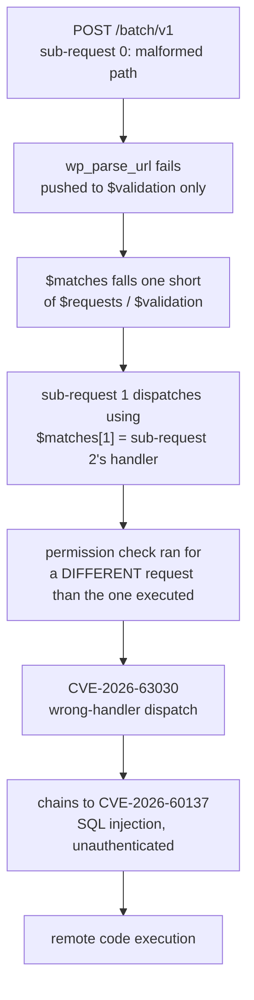

<div class="hero">
  <div class="hero-in">
    <span class="pill">Severity: Critical</span>
    <h1>wp2shell</h1>
    <p class="lede">A pre-authentication remote-code-execution chain in WordPress core, patched July 2026. No plugin required, no misconfiguration required: a stock install of an affected version was enough. The root cause is a single missing array append in the REST API's batch endpoint.</p>
    <div class="meta">
      <div><span class="k">CVE</span><span class="v amber">2026-63030</span></div>
      <div><span class="k">Chains to</span><span class="v amber">2026-60137</span></div>
      <div><span class="k">Vulnerable</span><span class="v alert">6.9.0-6.9.4, 7.0.0-7.0.1</span></div>
      <div><span class="k">Fixed</span><span class="v ok">6.9.5, 7.0.2</span></div>
      <div><span class="k">Discovered by</span><span class="v">Adam Kues, Assetnote</span></div>
      <div><span class="k">The fix</span><span class="v ok">one line</span></div>
    </div>
  </div>
</div>

*Investigated for educational and defensive purposes. No exploit payload is published. The SQL-injection-to-RCE chain is described at a mechanism level only; see the [disclosure note](#disclosure) below.*



## Read the writeup

**[The mechanism](./analysis/mechanism.html).** How `WP_REST_Server::serve_batch_request_v1()` builds two parallel arrays, how one malformed sub-request desyncs them, and the exact one-line diff between vulnerable 7.0.1 and patched 7.0.2. Includes a live, safe proof against genuinely vulnerable WordPress: the same request, on the same server, answering wrong before the patch and right after it.

**[Detection](./analysis/detection.html).** The request fingerprint, access-log hunting queries, and the PHP error-log tell that distinguishes a real attack attempt from routine batch traffic.

**[Indicators and mitigation](./analysis/IOCs.html).** WAF rules for nginx, Apache, and ModSecurity covering both URL shapes of the endpoint, plus a drop-in mu-plugin that blocks anonymous batch calls as a stop-gap ahead of patching.

**[The reproduction lab](https://github.com/ZenithGenius/wordpress-batch-rce-lab/tree/main/batch-rce-lab).** Docker Compose running real, vulnerable WordPress 7.0.1. A safe HTTP proof toggles between the vulnerable and patched source on the same running server and shows the response flip. A standalone PHP model reproduces the array desync with no WordPress at all.

## The one-line fix

```diff
  foreach ( $requests as $single_request ) {
      if ( is_wp_error( $single_request ) ) {
          $has_error    = true;
+         $matches[]    = $single_request;
          $validation[] = $single_request;
          continue;
      }
```

That is the entire difference between WordPress 7.0.1 and 7.0.2. Before it, `$matches` and `$validation` fall out of alignment the moment a batch request contains one malformed sub-request, and the dispatch loop reads `$matches[$i]` by index, so every sub-request after the broken one runs against the wrong route and the wrong permission result.

## Who found it, who patched it

Adam Kues, Assetnote (Searchlight Cyber's attack-surface-management arm), discovered the batch-route logic bug and reported it through WordPress's HackerOne program. WordPress shipped 7.0.2 and 6.9.5 with forced automatic updates for affected sites.

## Disclosure

This writeup and lab were built after WordPress's public fix (7.0.2 / 6.9.5) and Searchlight's public advisory. The array-desync mechanism (CVE-2026-63030) is reproduced in full, safely, because it requires only read-shaped requests to observe. The SQL-injection chain (CVE-2026-60137) that turns the desync into code execution is described conceptually only; no working SQLi or RCE payload is published here. If you run WordPress, update to 7.0.2 or 6.9.5, or apply the mitigations linked above, before experimenting with any of this.
